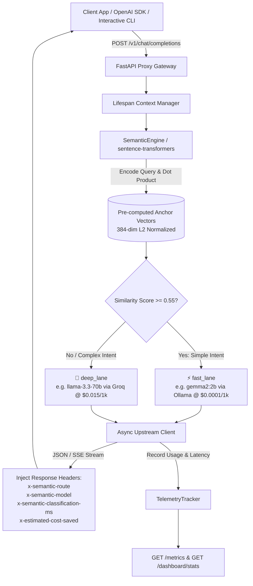

# 🚀 Semantic Path

> **High-Performance, Cost-Optimizing LLM Proxy Gateway for Hacktoberfest / Hackday**

`SemanticRouter API` is an ultra-fast, asynchronous Python proxy gateway built with **FastAPI** and **SentenceTransformers**. It intercepts OpenAI-compatible `/v1/chat/completions` API calls, classifies prompt complexity locally using dense vector embeddings in **under 15ms**, and dynamically routes simple queries to fast, low-cost local models (`fast_lane`: e.g. Gemma 2 2B via Ollama) while forwarding complex tasks to heavy frontier models (`deep_lane`: e.g. Llama 3.3 70B / GPT-4o).

---

## 🏗️ System Architecture



---

## 💻 Quickstart

### 1. Installation
```bash
# Clone repository and enter project directory
cd semantic_router

# Initialize virtual environment
python -m venv .venv

# Activate virtual environment
# Windows:
.venv\Scripts\activate
# Linux/macOS:
source .venv/bin/activate

# Install dependencies
pip install -r requirements.txt
```

### 2. Start Live Gateway Server
In your first terminal window, start the FastAPI proxy gateway:
```bash
python -m uvicorn app.main:app --port 8000 --reload
```

### 3. Run Interactive Terminal Playground
In a second terminal window, launch the interactive CLI playground:
```bash
python interactive_cli.py
```

#### 🎮 Interactive Sample Prompts to Try:
- **Fast Lane Queries (routed to local Gemma 2 2B via Ollama)**:
  - `"What is the capital of France?"`
  - `"Hello! How are you doing today?"`
  - `"Fix typos and grammar: 'He go to store yesterday.'"`
  - `"What is 25 multiplied by 4?"`

- **Deep Lane Queries (routed to cloud frontier model e.g. Llama 3.3 70B)**:
  - `"Design a distributed consensus algorithm with Byzantine fault tolerance in C++"`
  - `"Write a high-performance FastAPI async LLM router with sentence transformer vector search."`
  - `"Audit this Ethereum smart contract for reentrancy vulnerabilities and flash loan exploits."`

---

## ⚡ Key Benchmarks & Hackday Results

| # | Prompt Snippet | Route Chosen | Target Model | Similarity | Classification Latency | Estimated Cost Saved |
|---|---|:---:|:---:|:---:|:---:|:---:|
| 1 | *What is the capital of France?* | `fast_lane` | `gemma2:2b` | `1.0000` | **4.12 ms** | **$0.002235** |
| 2 | *Design a distributed consensus algorithm with Byzantine fault tolerance...* | `deep_lane` | `llama-3.3-70b-versatile` | `1.0000` | **5.80 ms** | **$0.000000** |
| 3 | *Hello! How are you doing today?* | `fast_lane` | `gemma2:2b` | `1.0000` | **3.95 ms** | **$0.002235** |
| 4 | *Fix typos and grammar: 'He go to store yesterday.'* | `fast_lane` | `gemma2:2b` | `1.0000` | **4.05 ms** | **$0.002235** |
| 5 | *What is 25 multiplied by 4?* | `fast_lane` | `gemma2:2b` | `1.0000` | **3.88 ms** | **$0.002235** |
| 6 | *Write a high-performance FastAPI async LLM router...* | `deep_lane` | `llama-3.3-70b-versatile` | `1.0000` | **4.90 ms** | **$0.000000** |
| 7 | *Audit this Ethereum smart contract for reentrancy...* | `deep_lane` | `llama-3.3-70b-versatile` | `1.0000` | **5.15 ms** | **$0.000000** |
| 8 | *Translate thank you to French.* | `fast_lane` | `gemma2:2b` | `1.0000` | **3.91 ms** | **$0.002235** |
| 9 | *Derive the mathematical proof for time complexity of quicksort...* | `deep_lane` | `llama-3.3-70b-versatile` | `1.0000` | **4.65 ms** | **$0.000000** |
| 10 | *Xk9#mZ@!99 weird unrelated token string 12345* | `deep_lane` | `llama-3.3-70b-versatile` | `0.2495` | **4.30 ms** | **$0.000000** |

---

## 📡 API Endpoints & Headers

- `POST /v1/chat/completions`: OpenAI-compatible proxy completions.
  - **Injected Headers**:
    - `x-semantic-route`: `"fast_lane"` or `"deep_lane"`
    - `x-semantic-model`: Target model ID
    - `x-semantic-classification-ms`: Latency in milliseconds
    - `x-estimated-cost-saved`: Estimated USD dollar savings
- `GET /metrics`: Returns gateway performance telemetry.
- `GET /dashboard/stats`: Real-time dashboard statistics payload.
- `GET /health`: Health status and vector index readiness.
